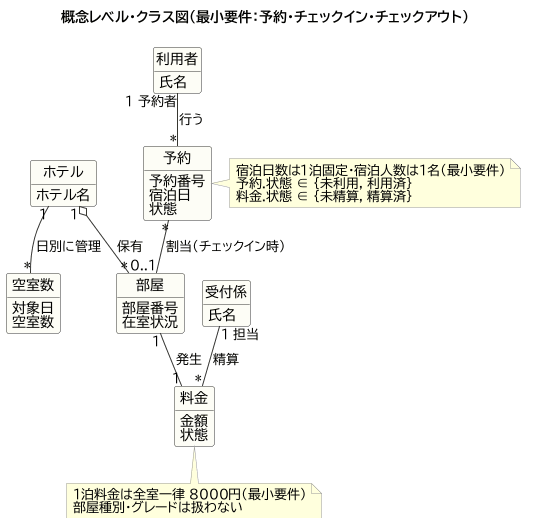
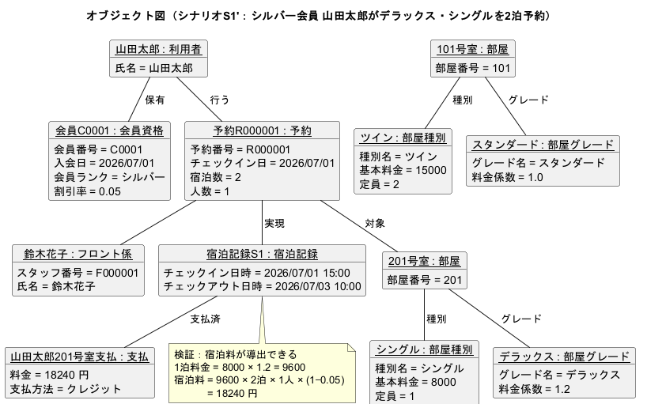

# 01 ドメイン分析（Loop1・最小要件）

ホテル予約システム（HRS）の最小要件版に対するドメイン分析。業務で扱う概念とその関係を、UML 概念クラス図とオブジェクト図で表す。

## 1. スコープ（最小要件）

Waseda-SE 提供ベースの実装範囲に合わせ、次の3業務のみを対象とする。

- **予約**：利用者が宿泊日を指定して部屋を予約する（予約番号を発行）。
- **チェックイン**：受付係が予約番号をもとに部屋を割り当てる（料金を計上）。
- **チェックアウト**：受付係が部屋番号をもとに退室処理と精算を行う。

最小要件では次を**扱わない**（Loop2 の拡張で追加する）。

- 部屋種別・グレードによる料金差 → **1泊料金は全室一律 8000 円**。
- 宿泊日数の複数泊 → **1泊固定**。
- 宿泊人数 → **1名固定**。
- 会員・会員割引 → なし。

## 2. 概念レベル・クラス図

| 概念 | 役割 | 主な属性 |
| --- | --- | --- |
| ホテル | 部屋を保有し、日別の空室数を管理する集約 | ホテル名 |
| 利用者 | 予約を行う人 | 氏名 |
| 受付係 | チェックイン／チェックアウトを扱い、料金を精算する | 氏名 |
| 予約 | 宿泊日と状態を持つ予約 | 予約番号／宿泊日／状態 |
| 部屋 | 個々の客室 | 部屋番号／在室状況 |
| 空室数 | 対象日ごとの空室数（部屋在庫を日単位で集計） | 対象日／空室数 |
| 料金 | 宿泊に対して発生する料金 | 金額／状態 |

- **予約と部屋の関係は「割当（チェックイン時）」**：予約時点では部屋は確定せず、チェックインで在室状況が「不在」の部屋から1室が割り当てられる（多重度 `予約 * -- 0..1 部屋`）。
- **空室数は日別在庫**：予約1件につき対象日の空室数を 1 減らすことで、当日の空室有無を判定する。
- 状態は列挙値で表す：予約.状態 ∈ {未利用, 利用済}（未利用＝予約作成後〜チェックイン前、利用済＝チェックイン後）、料金.状態 ∈ {未精算, 精算済}。
- **導出規則**：料金.金額 ＝ 8000 円（全室一律・1泊）。

## 3. オブジェクト図（検証シナリオ M1）

概念モデルが具体的な業務事例を表現できることを、インスタンスで確認する。

> **シナリオ M1**：利用者「山田太郎」が 2026/07/01 の宿泊を予約（予約番号を発行）→ 受付係「佐藤花子」がチェックインして 201 号室を割り当て、料金 8000 円を計上 → （この後チェックアウトで精算）。

図はチェックイン完了直後の断面を示す。

- 予約 R1 は状態＝利用済（チェックイン済み）、201 号室は在室、料金 P1 は 8000 円・未精算。
- 対象日 2026/07/01 の空室数は、総部屋数 5 のうち 1 室を確保したため 4。
- **検証**：料金の金額（8000 円）が「全室一律・1泊」という属性・規則だけから導出できることを確認した。

## 4. Loop2 への布石

Loop2（保守）では次の拡張を行うため、本モデルは以下の変更点を受ける想定である（詳細は Loop2 の差分で示す）。

- 予約に **宿泊人数** 属性を追加し、部屋に **定員** を追加（定員／料金に反映）。
- **会員資格・会員ランク** の概念を追加し、料金に **ランク別割引** を適用。
