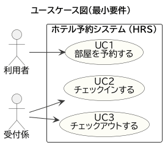
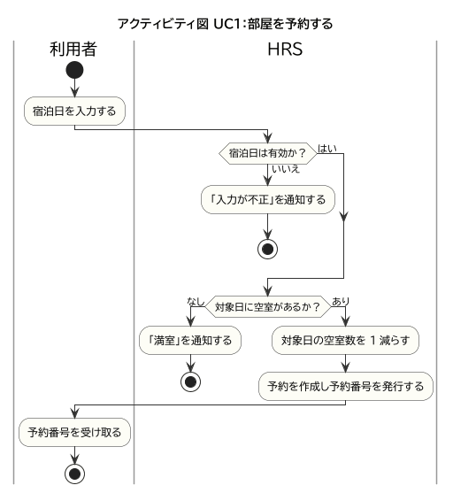
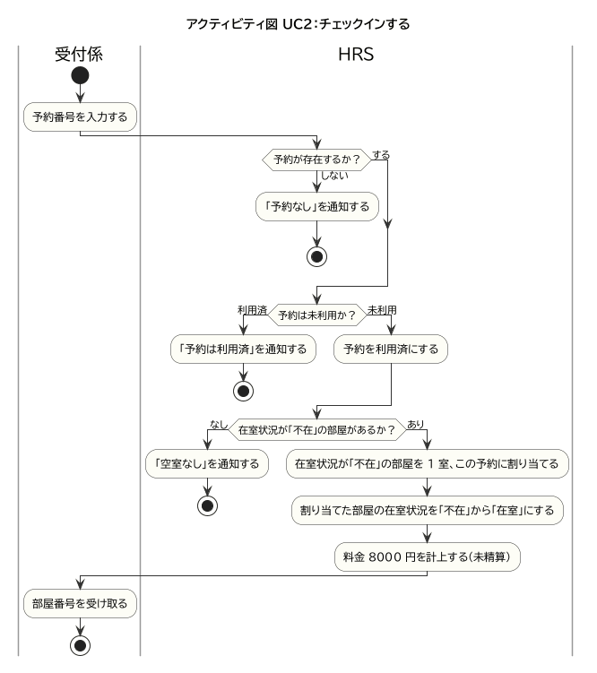
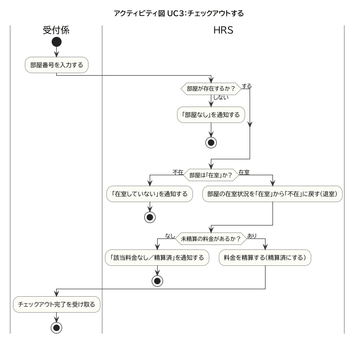

# 02 要求分析（Loop1・最小要件）

最小要件のHRSに対する機能要求を、ユースケース図・ユースケース記述・アクティビティ図で表す。

## 1. アクターとユースケース

- **利用者**：宿泊日を指定して部屋を予約する。
- **受付係**：予約番号でチェックイン、部屋番号でチェックアウトを行う。

| UC | 名称 | 主アクター |
| --- | --- | --- |
| UC1 | 部屋を予約する | 利用者 |
| UC2 | チェックインする | 受付係 |
| UC3 | チェックアウトする | 受付係 |

## 2. ユースケース記述

### UC1 部屋を予約する

| 項目 | 内容 |
| --- | --- |
| 主アクター | 利用者 |
| 事前条件 | — |
| 事後条件 | 対象日の予約が1件作成され、対象日の空室数が1減る。予約番号が発行される。 |
| 基本系列 | 1. 利用者が宿泊日を入力する 2. システムが宿泊日の形式を検証する 3. システムが対象日の空室数を確認し、1減らす 4. システムが予約を作成し予約番号を発行する 5. 利用者が予約番号を受け取る |
| 代替系列 | 2a. 宿泊日が不正：「入力が不正」を通知して終了 3a. 対象日が満室（空室数0）：「満室」を通知して終了 |

### UC2 チェックインする

| 項目 | 内容 |
| --- | --- |
| 主アクター | 受付係 |
| 事前条件 | 対象の予約が作成済み（未利用）である。 |
| 事後条件 | 予約が利用済になり、在室状況が「不在」の部屋から1室が割り当てられてその部屋が「在室」になり、料金（8000円・未精算）が計上される。 |
| 基本系列 | 1. 受付係が予約番号を入力する 2. システムが予約を照会する 3. システムが予約を利用済にする 4. システムが在室状況「不在」の部屋を1室、この予約に割り当てる 5. システムが割り当てた部屋の在室状況を「不在」から「在室」にする 6. システムが料金8000円を計上する（未精算） 7. 受付係が部屋番号を受け取る |
| 代替系列 | 2a. 予約が存在しない：「予約なし」を通知して終了 2b. 予約が利用済：「予約は利用済」を通知して終了 4a. 在室状況「不在」の部屋が無い：「空室なし」を通知して終了 |

### UC3 チェックアウトする

| 項目 | 内容 |
| --- | --- |
| 主アクター | 受付係 |
| 事前条件 | 対象の部屋がチェックイン済み（在室）で、未精算の料金がある。 |
| 事後条件 | 部屋の在室状況が「不在」に戻り、料金が精算済になる。 |
| 基本系列 | 1. 受付係が部屋番号を入力する 2. システムが部屋を照会する 3. システムが部屋の在室状況を「不在」に戻す（退室） 4. システムが料金を精算する（精算済にする） 5. 受付係がチェックアウト完了を受け取る |
| 代替系列 | 2a. 部屋が存在しない：「部屋なし」を通知して終了 2b. 部屋が在室していない：「在室していない」を通知して終了 4a. 未精算の料金が無い（該当なし／精算済）：エラーを通知して終了 |

## 3. アクティビティ図（各UCの振る舞い）

各図はスイムレーン（アクター／HRS）と、基本系列・代替系列（分岐）を含む。

### UC1 部屋を予約する

### UC2 チェックインする

### UC3 チェックアウトする

## 4. Loop2 への布石

Loop2（保守）では次の要求追加を行う（詳細は Loop2 の差分で示す）。

- **UC1 に宿泊人数の入力を追加**（定員／料金に反映）。
- **UC4 会員登録する** を新設し、UC1 で会員番号を任意入力できるようにする。
- **UC3（チェックアウト）で会員ランク割引を適用**し、割引額を表示する。
