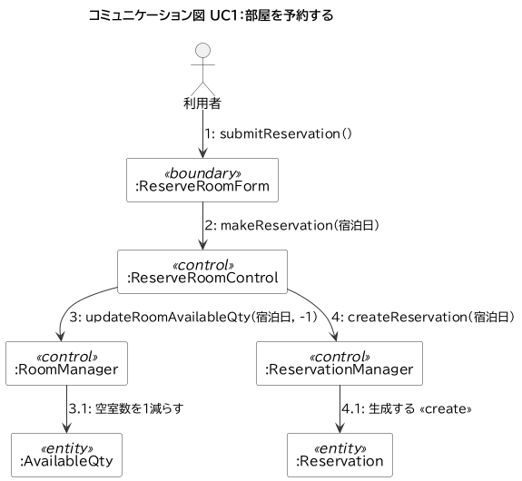
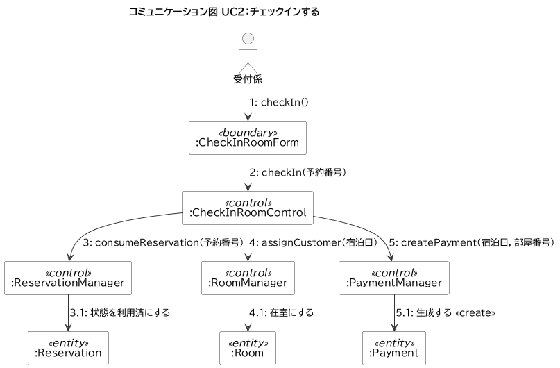
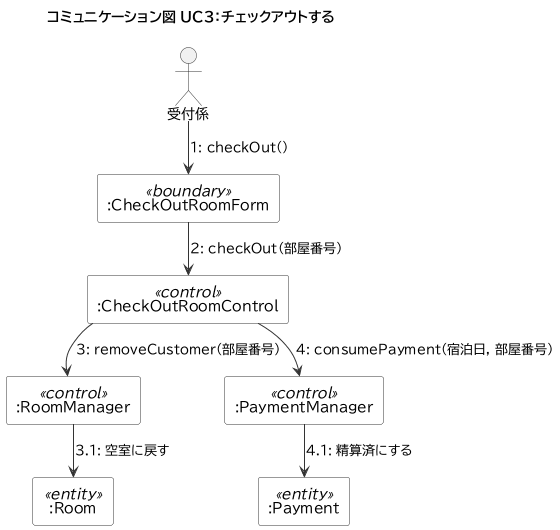
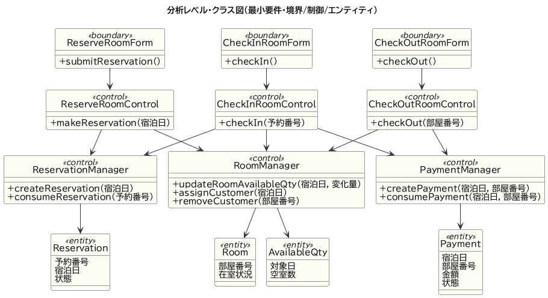

# 03 システム分析（Loop1・最小要件）

要求分析（02）の各ユースケースを「どう実現するか」に落とし込む。ロバストネス分析で登場オブジェクトを 境界／制御／エンティティ に分類し、コミュニケーション図で相互作用を、分析クラス図で操作の集約を示す。

## 1. ロバストネス分析の方針（B/C/E）

| 種別 | ステレオタイプ | 役割 | 該当クラス |
| --- | --- | --- | --- |
| 境界 | «boundary» | アクターとの入出力 | ReserveRoomForm／CheckInRoomForm／CheckOutRoomForm |
| 制御 | «control» | ユースケースの手順・業務ロジック | 各Control、各Manager |
| エンティティ | «entity» | 業務データ | Reservation／Room／AvailableQty／Payment |

- Form（境界）は Control を、Control は Manager を、Manager は Entity を操作する（上位→下位の一方向）。
- Manager は Waseda-SE の設計に合わせ、ドメインの手続きを担う制御オブジェクトとして扱う。

## 2. コミュニケーション図（相互作用）

メッセージには階層番号を付す（`n` が上位の呼び出し、`n.1` がその内部で発生する呼び出し）。

### UC1 部屋を予約する

空室数の更新（3・3.1）と予約の生成（4・4.1）を Control が順に呼ぶ。1泊料金の計算責務はこの段階では現れない（チェックイン時に計上）。

### UC2 チェックインする

予約の消費（3）→ 部屋の割当（4）→ 料金の生成（5）を Control が統括する。

### UC3 チェックアウトする

退室（3・部屋を空室に戻す）と精算（4・料金を精算済にする）の2処理からなる。**これが Step5 で実装する `CheckOutRoomControl.checkOut()` の中身に一致する。**

## 3. 分析レベル・クラス図

全コミュニケーション図に現れたメッセージを操作として各クラスに集約したもの。

- 境界3・制御6（Control3＋Manager3）・エンティティ4 の計13クラス。
- 依存の向きは 境界 → 制御 → エンティティ で一方向。

## 4. Loop2 への布石

Loop2 では次が加わる（詳細は差分で示す）。

- «control» に MembershipManager、«entity» に Membership／MemberRank を追加。
- Payment に会員番号・割引情報が加わり、チェックアウトの相互作用に「割引率の問い合わせ」が増える。
