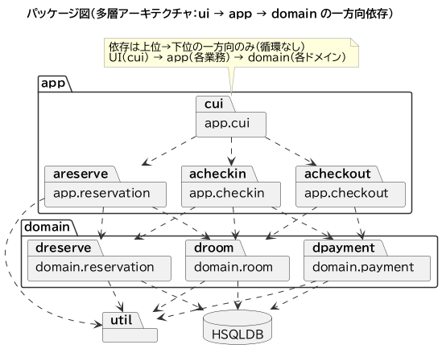
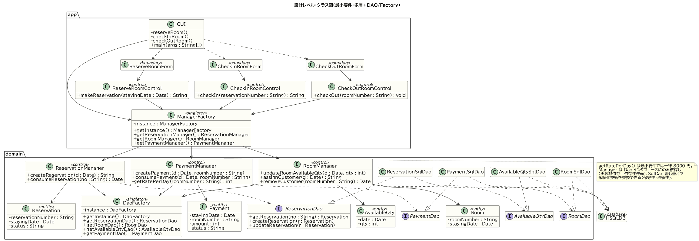

# 04 アーキテクチャ設計（Loop1・最小要件）

分析（03）の構造を、実装可能なアーキテクチャへ落とす。多層構成とパッケージ依存、および非機能要件を満たす設計クラス図を示す。ベースは Waseda-SE 提供の構成をそのまま踏襲する。

## 1. 非機能要件と実現方針

| ID | 非機能要件 | 実現方針（設計での対応） |
| --- | --- | --- |
| NFR1 | 保守性・拡張性（実装の差し替え容易性） | **DAO パターン**：`ReservationDao` 等のインタフェースと `ReservationSqlDao` 等の実装を分離。Manager はインタフェースにのみ依存（依存性逆転）。 |
| NFR2 | 移植性（永続化技術からの独立） | SQL/JDBC 操作を `*SqlDao` に閉じ込め、上位層は DB を知らない。DB を替えても Dao 実装の差し替えで済む。 |
| NFR3 | 変更影響の局所化 | **多層アーキテクチャ**：`ui → app → domain` の一方向依存（循環なし）。UI 変更が domain に波及しない。 |
| NFR4 | 生成・取得の一元管理 | **Factory（Singleton）**：`ManagerFactory`／`DaoFactory` が唯一の生成点。依存の差し替え箇所を集約。 |
| NFR5 | 例外処理の一貫性・追跡性 | 層別例外（`Reservation/Room/PaymentException` → `AppException`）で詳細メッセージを集約し、境界で整形表示。 |
| NFR6 | 予約番号の一意性 | `ReservationManager` が時刻ベースで採番（`synchronized` で衝突回避）。 |

## 2. パッケージ図（多層アーキテクチャ）

- `app.cui`（UI）→ `app.{reservation,checkin,checkout}`（業務）→ `domain.{reservation,room,payment}`（ドメイン）の一方向依存。
- `domain.*` のみが HSQLDB に依存し、`util`（`DateUtil`）は各層から共用される。
- → NFR3（変更影響の局所化）を満たす。

## 3. 設計レベル・クラス図

型・可視性（+/−）・static（Factory の `getInstance`）・«interface»／«singleton» ステレオタイプを明記した実装直結の設計図。

### 非機能要件との対応

- **Factory（Singleton）**：`CUI`・各 Control は `ManagerFactory` 経由で Manager を得る。各 Manager は `DaoFactory` 経由で Dao を得る。→ NFR4。
- **DAO（interface / impl）**：`ReservationSqlDao ..|> ReservationDao`。Manager は `..> ReservationDao`（インタフェース）に依存し、`ReservationSqlDao`（実装）を直接知らない。→ NFR1・NFR2。
- **一方向依存**：app → domain の向きのみ。→ NFR3。
- **`PaymentManager.getRatePerDay()`**：最小要件では一律 8000 円を返す。ここが Loop2 で会員割引を織り込む**拡張点**（現時点でメソッドとして分離済み）。

## 4. Loop2 への布石

- «entity» に `Membership`／`MemberRank`、«control» に `MembershipManager`、対応する `MembershipDao`／`MembershipSqlDao` を **追加**（既存クラスの構造は保持）。
- `Reservation`・`Payment` に会員番号列を追加。`PaymentManager.getRatePerDay()` に人数・割引を織り込む。
- 追加は Factory と DAO パターンの枠内で行うため、NFR1〜NFR4 を維持したまま拡張できる。
