# 05 保守（Loop2）— 各図の差分

Loop1（最小要件）に対し、保守として次の4機能を追加する。本書は Step1〜4 の各図を **Loop1 → Loop2 の差分**として示す（図中の**オレンジ＝Loop2で追加した要素**）。実装は別途 Step5 で行う。

## Loop2 で追加する機能

| # | 機能 | 概要 |
| --- | --- | --- |
| ① | 複数人数 | 予約に人数を持ち、部屋の定員以下で割り当て。料金に人数を反映（8000円 × 人数） |
| ② | 会員登録（UC4・新設） | 会員番号を発行し、氏名・ランクを登録 |
| ③ | 会員ランク割引 | ランク（一般/シルバー/ゴールド＝0/0.05/0.10）に応じチェックアウトで割引 |
| ④ | 予約キャンセル（UC5・新設） | 未利用の予約をハード削除し、空室数を +1 で戻す（DeleteReservation） |

宿泊日数は **1泊固定のまま**。部屋種別・グレードによる料金差は**扱わない**（会員ランクによる割引のみ）。

料金式： **宿泊料 ＝ 8000円 × 人数 ×（1 − ランク.割引率）**

---

## Step1 ドメイン分析

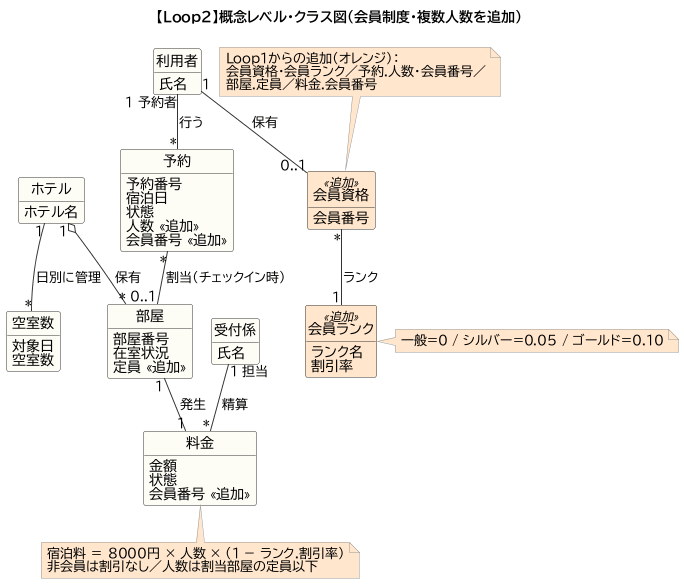

**差分（Loop1→Loop2）**
- クラス追加：**会員資格**（会員番号）、**会員ランク**（ランク名／割引率）。
- 属性追加：予約に **人数・会員番号**、部屋に **定員**、料金に **会員番号**。
- 関連追加：利用者 1 — 0..1 会員資格、会員資格 * — 1 会員ランク。
- 導出規則：宿泊料の式に **人数** と **割引率** を反映。

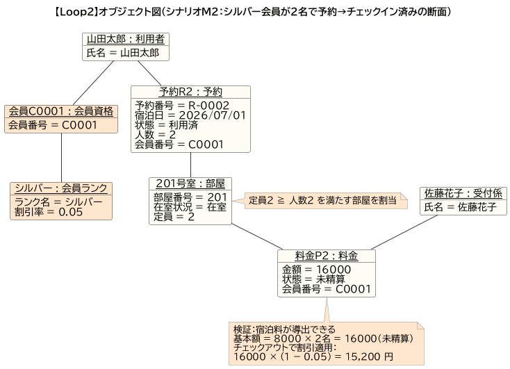

**差分**：検証シナリオを M1（1名・非会員）→ **M2（シルバー会員・2名）**に更新。基本額 8000×2＝16000、チェックアウトで 16000×(1−0.05)＝**15,200円**が導出できることを確認。

---

## Step2 要求分析

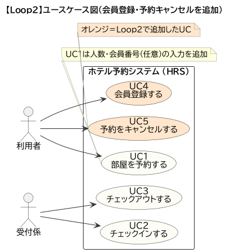

**差分**：UC を3→5に。**UC4 会員登録する**・**UC5 予約をキャンセルする**（ともにアクター＝利用者）を新設。UC1 は人数・会員番号(任意)の入力を追加。

### 追加ユースケース記述

**UC4 会員登録する**（主アクター：利用者）
- 事後条件：会員番号が1件発行され、氏名・ランクが登録される。
- 基本系列：1. 氏名・希望ランクを入力 → 2. 会員番号を採番 → 3. 会員資格を登録 → 4. 会員番号を受け取る。
- 代替系列：1a. 入力不正 → 「入力が不正」を通知して終了。

**UC5 予約をキャンセルする**（主アクター：利用者）
- 事前条件：対象予約が未利用（チェックイン前）である。
- 事後条件：予約が削除され、対象日の空室数が1増える。
- 基本系列：1. 予約番号を入力 → 2. 予約を照会 → 3. 予約を削除 → 4. 空室数を+1 → 5. 完了を受け取る。
- 代替系列：2a. 予約なし → 通知して終了／2b. 利用済（チェックイン済み） → 「取消不可」を通知して終了。

### アクティビティ図

| UC1（更新） | UC4（新規） | UC5（新規） |
| --- | --- | --- |
| 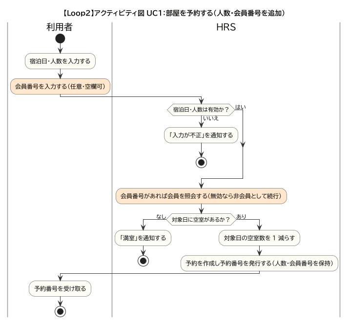 | 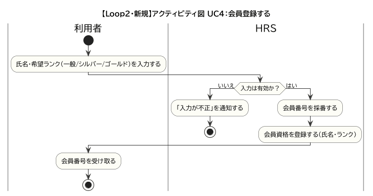 | 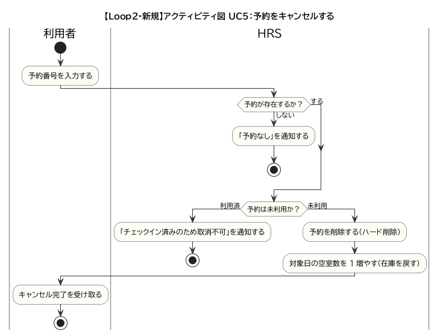 |

- UC1 差分：人数・会員番号の入力と会員照会を追加（会員番号が無効なら非会員として続行）。
- UC5 差分：**未利用のみ削除可**、チェックイン済みは取消不可。**空室数を +1 で戻す**（チェックアウトが戻さないのと対照的：キャンセルは予約が無かったことになるため）。

---

## Step3 システム分析

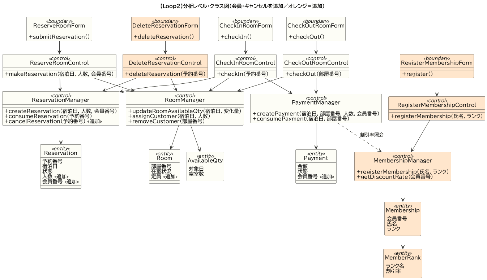

**差分**
- 境界追加：RegisterMembershipForm／DeleteReservationForm。
- 制御追加：RegisterMembershipControl／DeleteReservationControl／**MembershipManager**。
- エンティティ追加：**Membership／MemberRank**。
- 操作追加：ReservationManager に `cancelReservation`、RoomManager の `assignCustomer` に人数、PaymentManager の `createPayment` に人数・会員番号。
- 依存追加：PaymentManager ..> MembershipManager（割引率照会）。

### コミュニケーション図

| UC4 会員登録（新規） | UC5 キャンセル（新規） |
| --- | --- |
| 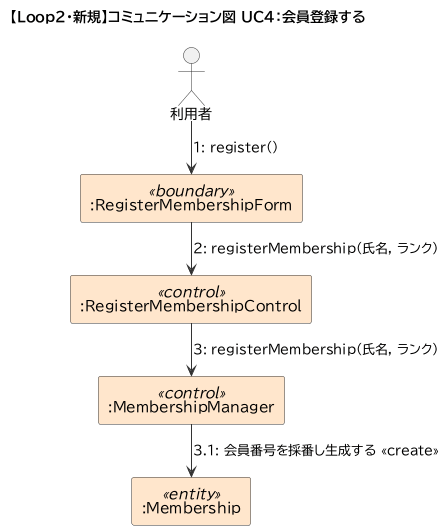 | 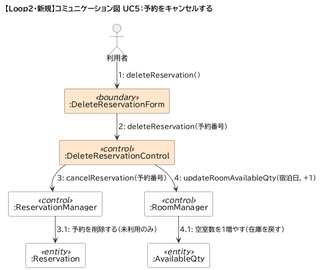 |

**UC3 チェックアウト（更新）**

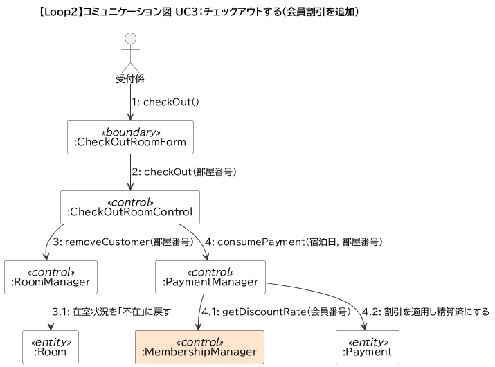

- 差分：consumePayment の内部で **MembershipManager.getDiscountRate(会員番号)** を呼び、割引を適用して精算（4.1 が追加メッセージ）。

---

## Step4 アーキテクチャ設計

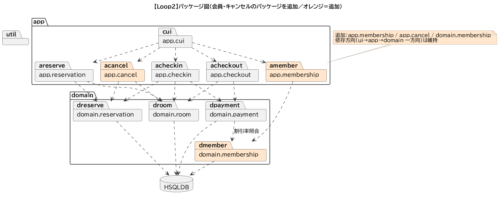

**差分**：パッケージ追加 **app.membership／app.cancel／domain.membership**。`domain.payment ..> domain.membership`（割引率照会）を追加。**ui→app→domain の一方向依存は維持**（非機能要件 NFR3 を保つ）。

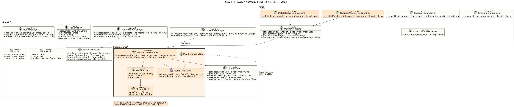

**差分**
- 追加スライス **domain.membership**（MembershipManager／MembershipDao／MembershipSqlDao／Membership／MemberRank）を、Loop1と同じ **DAO＋Factory パターン**で追加。
- Factory拡張：ManagerFactory に `getMembershipManager`、DaoFactory に `getMembershipDao`。
- 既存クラスへの追加：Reservation（人数・会員番号）、Room（定員）、Payment（会員番号）、ReservationDao（`deleteReservation`）、各Managerのシグネチャ。
- **既存クラスの構造・依存方向は保持**したまま、追加・オーバーロード・カラム追加のみで拡張（NFR1〜4 を維持）。

---

## Step5（実装）への申し送り

- 新パッケージ：`app.membership`・`app.cancel`・`domain.membership`。
- 既存改修（非破壊）：`Reservation`/`Room`/`Payment` に列追加、`ReservationDao.deleteReservation` 追加、`assignCustomer(date, guests)`・`createPayment(date, room, guests, memberNo)` のオーバーロード、`PaymentManager` から `MembershipManager` への割引率照会。
- CUI：`4: DeleteReservation`・会員登録メニューを追加。
- DB：`MEMBERSHIP` 表と、`RESERVATION`/`PAYMENT`/`ROOM` への列追加（`numberofguests`・`membernumber`・`capacity`）。
